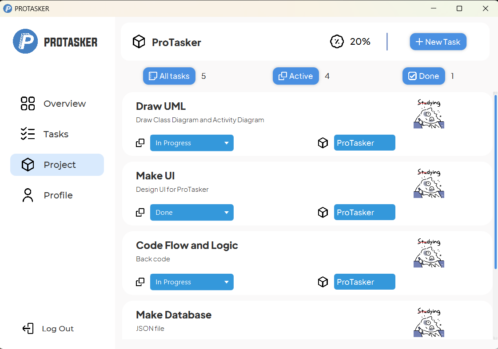

# [PROTASKER]

**ProTasker** is an application that allows users to create projects and create and manage their tasks. The project was done by **Đỗ Vũ Hải Đăng**, in the course of **Object Oriented Programming** at **ProPTIT**.


## Authors

- [@DarkJyn](https://github.com/DarkJyn)

## Installation

Cách cài đặt dự án

```bash
  - Clone the repo
  - Run AppLaucher.bat
```

## Demo

Link Video Demo Youtube : https://youtu.be/DziJp_qkL20?si=hyOgO_aOYZT9HCVw


## Screenshots
- Màn hình đăng nhập / đăng ký:


- Các giao diện chính:




## Features
- Create project management projects.
- In Projects, you can create subtasks.
- Tasks can directly edit the status and update the Project progress instantly
- Feature to display the parameters of each project
- Project search by name feature
- Edit user credentials and profile picture
- Sorting and filtering of Projects and Tasks.

## Usage
- Project Structure
```bash


├── protasker
│   ├── Main.java
│   ├── Controller
│   │   ├── DashBoardController.java
│   │   ├── LoginController.java
│   │   ├── NewProjectController.java
│   │   ├── ProfileScreenController.java 
│   │   ├── ProjectDetailController.java 
│   │   ├── ProjectHboxController.java 
│   │   ├── ProjectItemController.java 
│   │   ├── ProjectScreenController.java 
│   │   ├── SignUpController.java 
│   │   ├── TaskScreenController.java 
│   │   ├── TaskController.java 
│   │   └── NewTaskController.java
│   ├── Model
│   │   ├── Authenticator.java
│   │   ├── FileContact.java
│   │   ├── ImageViewJson.java
│   │   ├── Project.java
│   │   ├── Task.java
│   │   ├── User.java
│   │   ├── UserInfo.java
│   │   ├── userdata.json
│   │   └── ProgressCircle.java
```
## UML
#### Activity Diagram

#### Class Diagram

## License

[MIT](https://choosealicense.com/licenses/mit/)

